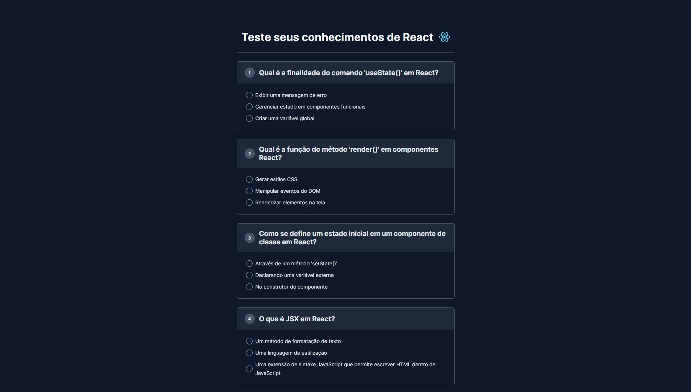

  

Aplicação desenvolvida no evento NLW Expert da Rocketseat na trilha HTML+CSS+JS.

  <a href="#-tecnologias">Tecnologias</a>&nbsp;&nbsp;&nbsp;|&nbsp;&nbsp;&nbsp;
  <a href="#-projeto">Projeto</a>&nbsp;&nbsp;&nbsp;|&nbsp;&nbsp;&nbsp;
  <a href="#-preview">Preview</a>

  

 

## 🚀 Tecnologias
Esse projeto foi desenvolvido com as seguintes tecnologias:
- [HTML5](https://html.com/)
- [CSS3](https://developer.mozilla.org/pt-BR/docs/Web/CSS)
- [Javascript](https://www.javascript.com)
- [ChatGPT](https://chat.openai.com)

## 💻 Projeto
Nesse projeto foi desenvolvido um quiz dinâmico, no 14° evento nlw expert da rocketseat, as questões do projeto foi gerado pelo ChatGPT. O objetivo do projeto é para revisar e testar os conhecimentos técnicos, aproveitei e criei um arquivo .md para explicar o script js do evento. Acrescentei por fora da proposta do evento, uma modal onde vai mostrar o retorno da quantidade de questões acertadas.

  

### Veja o projeto funcionando <a href="https://kevynfirst.github.io/quiz">aqui</a>. 👈
 

## 📝 Licença
Esse projeto está sob a licença MIT.
  

## 😉 Obrigado por visitar meu projeto

Você pode conferir outros projetos que desenvolvi aqui no meu GitHub, ou entrar em contato comigo pelos demais links.

